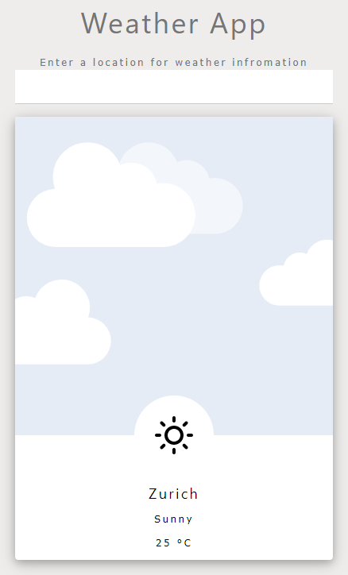

# Weather-APP-W3.CSS
A Weather App that shows weather of your favourite city
***
It uses *AccuWeather API* to get up to date weather infromation in your favorite city. In addition, it also uses browser local storage to keep the record of the last searched city so that you do not have to type the city name every time you open the app. 

***

***
The app was created using JavaScript and W3.CSS framework